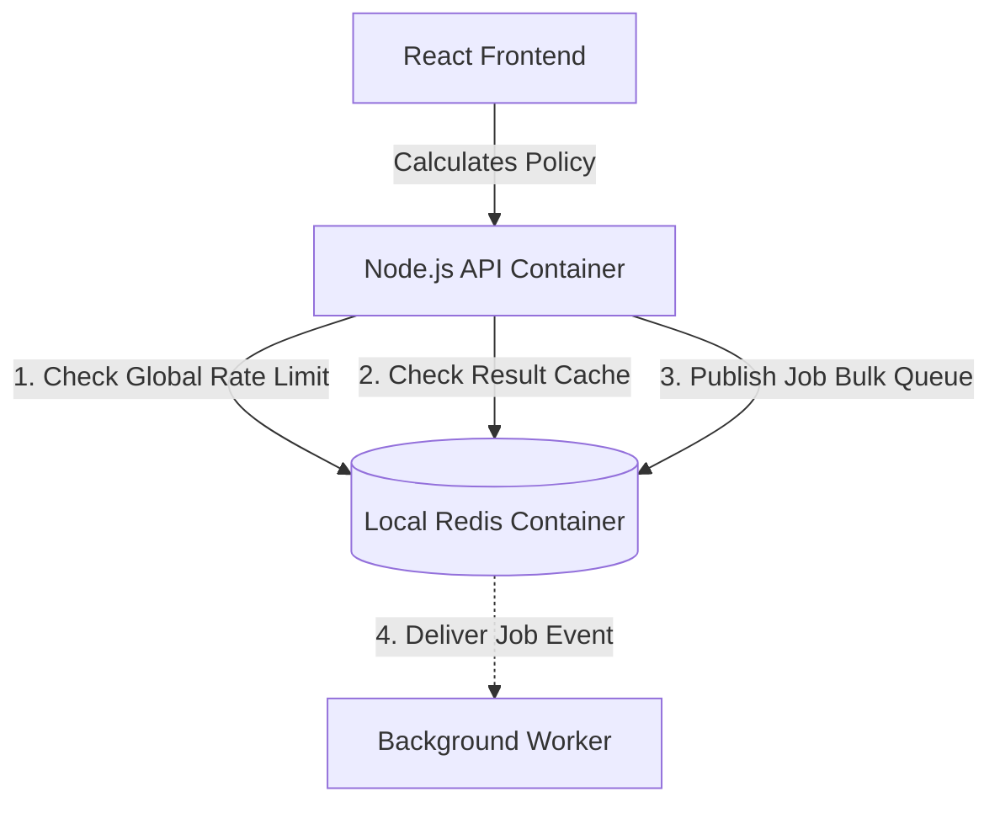
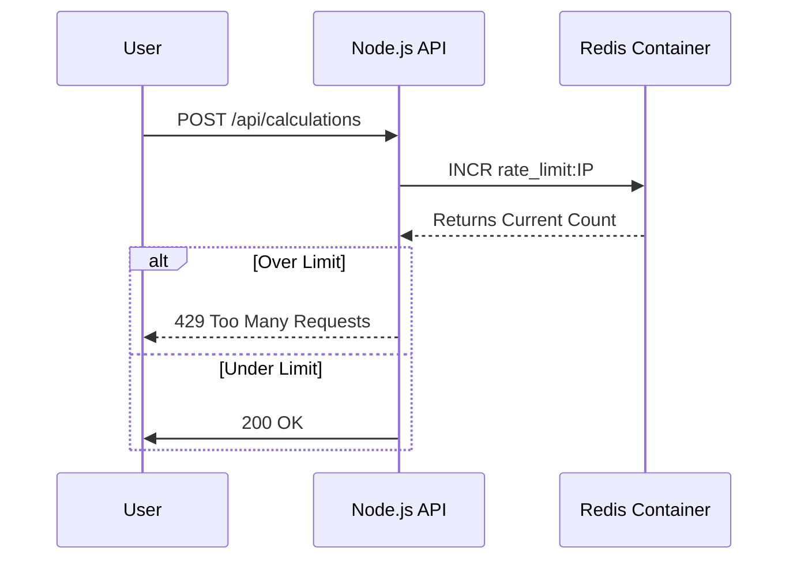
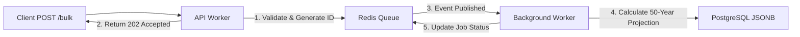
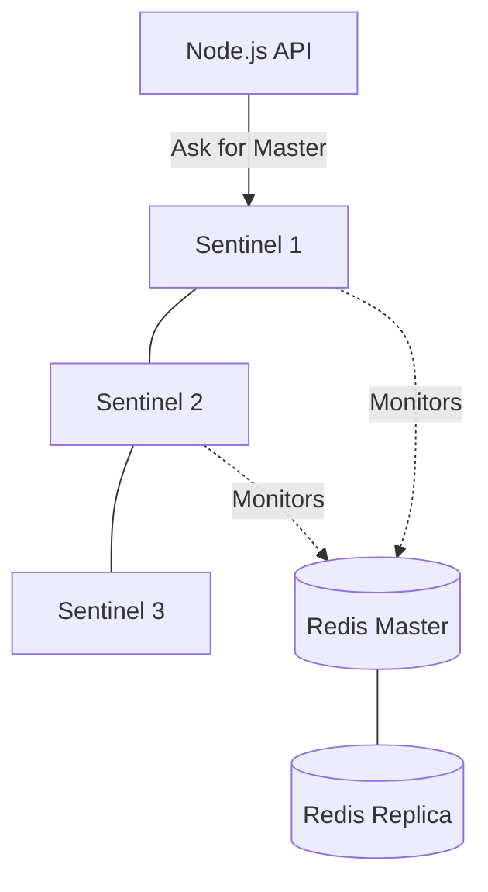

# Architecture Master: Benefit Illustration Engine

This document provides a deep-dive into the technical architecture of the NexGen Benefit Illustration Engine, focusing on multi-core scalability and event-driven processing.

## 1. High-Level Architecture Diagram
The system follows a stateless, distributed approach to ensure it can scale from single-user requests to millions of bulk policy simulations.

## 2. API Lifecycle & Rate Limiting
The system uses a **Token Bucket** strategy implemented directly in Redis for high-performance rate limiting across all cluster nodes.

## 3. Native API Clustering: Under the Hood
Unlike basic Node.js apps that run on a single thread, NexGen uses the **Cluster Module**.
- **Master Process**: Orchestrates the system and monitors worker health. It does *not* handle HTTP requests; it acts as a load balancer and manager.
- **Worker Processes**: One fork per CPU core. Handles incoming HTTP traffic in parallel.
- **Shared Listen Port**: All workers share the same server port (e.g., 5000) using a handle-passing mechanism in the OS kernel.
- **IPC (Inter-Process Communication)**: Workers communicate with the Master via hidden pipes to report health and status.

## 4. Event-Driven Bulk Processing: Job Lifecycle
To handle "millions of records," we decouple calculation from the API request cycle.

## 5. Resilience & War Cases (Failover Scenarios)

### Case 1: The "Worker Death" Scenario
**Situation**: A worker process crashes due to an unhandled exception or memory leak.
- **Under the Hood**: The Master process listens for the `exit` event.
- **Recovery**: Within milliseconds, the Master calls `cluster.fork()` to spin up a fresh worker.
- **User Impact**: Zero. Other active workers handle the load while the new one boots.

### Case 2: The "Redis Down" Scenario
**Situation**: The Redis container stops responding or crashes.
- **Under the Hood**: The API uses a `circuit-breaker` pattern (if implemented) or fails fast on rate-limit checks.
- **Recovery**: The system can be configured to fallback to a "Stateless Mode" where rate limiting is disabled, or it retries connection with exponential backoff.
- **User Impact**: 503 Service Unavailable or temporary bypass of rate limits.

### Case 3: The "Memory Leak" War Case
**Situation**: A specific calculation logic consumes too much RAM over time.
- **Under the Hood**: The project includes a watchdog that monitors `process.memoryUsage()`. 
- **Recovery**: If a worker exceeds 1GB, it stops accepting new connections and exits gracefully. The Master then forks a clean worker.

## 6. Distributed Redis & Sentinel (High Availability)
In production, a single Redis instance is a "Single Point of Failure" (SPOF). NexGen is designed to work with **Redis Sentinel**.

### How Sentinel Works:
1. **Monitoring**: Three or more Sentinel processes constantly "Ping" the Redis Master.
2. **Quorum**: If 2/3 Sentinels agree the Master is dead, a **Failover** is triggered.
3. **Automatic Reconfiguration**: Sentinel promotes a Slave to Master.
4. **API Discovery**: The Node.js API uses a Sentinel-aware client (like `ioredis`). It asks Sentinel "Who is the current Master?" before every critical write.

## 7. Pub/Sub Under the Hood: The Event Bus
We use Redis Pub/Sub for the "Bulk Calculation" engine.
- **The Mechanic**: The API `PUBLISHES` a job ID to a channel. Background workers `SUBSCRIBE` to that channel.
- **Fire and Forget**: Standard Redis Pub/Sub is "at-most-once." If a worker is down when the message is sent, the message is lost.
- **NexGen Enhancement**: To ensure **"At-least-once"** delivery, we use a **Redis List (RPOPLPUSH)** or **Redis Streams**. This ensures that if a worker crashes mid-calculation, the job stays in the "Pending" list until another worker picks it up.

## 8. Interview Talking Points:
- **"What is Quorum?"**: It's the minimum number of Sentinels (usually 2 out of 3) that must agree before a failover happens. This prevents "Split-Brain" scenarios.
- **"Why not just use a Load Balancer for Redis?"**: Redis is stateful. A load balancer doesn't know which instance is the Read-Only Slave and which is the Write-Master. Sentinel provides that intelligence.
- **"How do you handle delivery guarantees?"**: While Pub/Sub is fast, we use Redis Streams for bulk jobs because they provide acknowledgement (ACK) and persistence, ensuring no insurance calculation is ever skipped.
