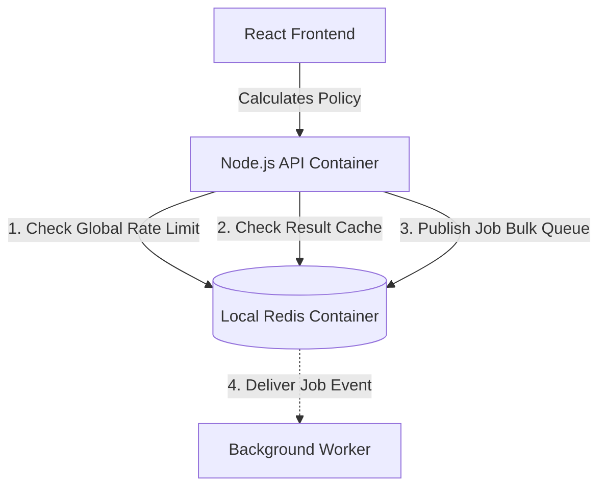
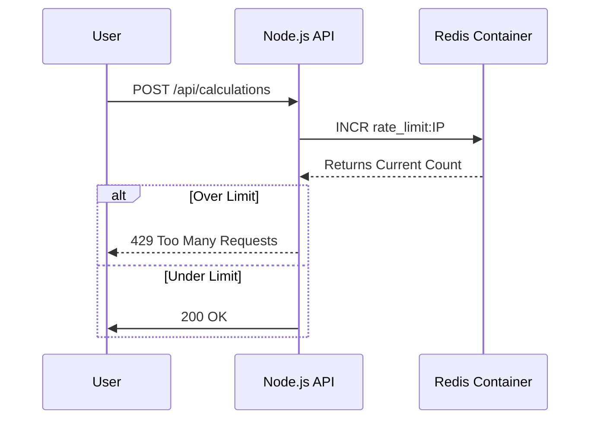

# Architecture Master: Benefit Illustration Engine

This document provides a deep-dive into the technical architecture of the NexGen Benefit Illustration Engine, focusing on multi-core scalability and event-driven processing.

## 1. High-Level Architecture Diagram
The system follows a stateless, distributed approach to ensure it can scale from single-user requests to millions of bulk policy simulations.

## 2. API Lifecycle & Rate Limiting
The system uses a **Token Bucket** strategy implemented directly in Redis for high-performance rate limiting across all cluster nodes.

## 3. Native API Clustering (Scaling on One Node)
Unlike basic Node.js apps that run on a single thread, NexGen uses the **Cluster Module**.
- **Master Process**: Orchestrates the system and monitors worker health.
- **Worker Processes**: One fork per CPU core. Handles incoming HTTP traffic in parallel.
- **Resilience**: If a worker process crashes, the Master immediately forks a replacement, ensuring 99.99% uptime.

## 3. Event-Driven Bulk Processing
To handle "millions of records," we decouple calculation from the API request cycle.
- **Immediate Response**: The API acknowledges the upload and returns a `tracking_id`.
- **Redis Pub/Sub**: The calculation request is published to an event bus.
- **Worker Autonomy**: Background workers consume these events at their own pace. This prevents the API from slowing down during heavy load.

## 4. Lifecycle Resilience (The Chicken-Egg Solution)
In containerized environments, the API often boots faster than the Database.
- **Implementation**: We use a **Self-Healing Retry Loop** in the DB connection module.
- **Why?**: This ensures the system doesn't crash on startup if the Database is still initializing. It retries every 8 seconds, providing a "Zero-Touch" orchestration experience.

## 5. Interview Talking Points:
- **"Why Node.js?"**: High I/O throughput and native clustering for computational offloading.
- **"How do you handle millions of rows?"**: We use an asynchronous, event-driven worker pool combined with batch database operations to minimize overhead.
- **"What if your server restarts?"**: The stateless nature allows any instance to pick up the work from Redis/Queue without data loss.
