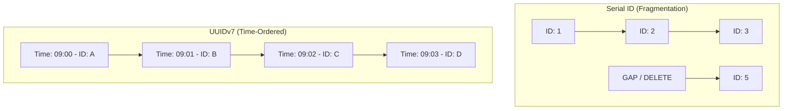

# Database Deep-Dive: Optimization & Integrity

NexGen's data layer is optimized for high-density writes and ultra-fast retrieval of policy projections.

## 1. Schema Strategy

### Key Tables
- **`users`**: Secure storage of masked identity.
- **`illustration_requests`**: Tracks every request with a high-performance **UUIDv7**.
- **`illustration_results`**: Stores actual projection arrays using **JSONB**.

## 2. Why UUIDv7?
In a system handling millions of rows, traditional `Serial (1, 2, 3...)` IDs fail.
- **Scale**: Prevents primary key collisions across distributed nodes.
- **Performance**: UUIDv7 is **time-sortable**. Unlike UUIDv4 (random), UUIDv7 maintains index proximity, drastically improving `INSERT` performance on large tables.
- **Security**: Prevents "ID Enumeration" attacks (an attacker cannot guess valid IDs by adding +1).

## 3. JSONB vs Relational Normalization
We store the projection array as a `JSONB` column rather than splitting years into separate rows.
- **Speed**: A single `SELECT` retrieves the entire 50-year projection in one read.
- **Efficiency**: Reduces "Join" overhead and index size significantly.
- **Flexibility**: Different products (Term, Life) can store varying structures without schema migrations.

## 4. Database War Cases (Failover & Performance)

### Case 1: Connection Pool Exhaustion
**Situation**: 1,000 users hit the API at once, but the DB only allows 50 connections.
- **Outcome**: The system uses `pg-pool`. Requests wait in a queue for 30s before timing out.
- **Mitigation**: We use **PgBouncer** (in production) or optimized connection pooling inside the API cluster (each worker gets its own pool).

### Case 2: The "Zombie Query" Scenario
**Situation**: A complex aggregate query takes 5 minutes, locking the table.
- **Outcome**: Future inserts might be blocked depending on the lock type.
- **Mitigation**: We set `statement_timeout = 29000` (29 seconds). This kills any query that takes too long, saving the database from a total freeze.

## 5. Performance Visualization: UUIDv7 vs. Serial

*UUIDv7 ensures that even in distributed environments, new records are physically adjacent on the disk, minimizing "I/O Wait."*

## 6. PostgreSQL Scaling Strategy
As the user base grows, a single Postgres instance hits CPU/Memory limits. We scale using:

### A. PgBouncer (Connection Multiplexing)
- **Problem**: Node.js workers create many connections, which is expensive for Postgres.
- **Solution**: PgBouncer sits in front of the DB. It maintains a small pool of real connections and "swaps" incoming API requests into them, allowing 10,000 clients to share 100 DB connections.

### B. Read Replicas (Vertical Split)
- **Strategy**: Calculations involve heavy `SELECT` queries for statistics. 
- **Setup**: We use 1 Master (Writes/Inserts) and 2+ Replicas (Reads).
- **Benefit**: Even during a 1-million-row bulk insert, users can still view their dashboards instantly by hitting the replicas.

## 7. Deep Dive: Why this Schema? (JSONB vs. Normalized)
In insurance, a "Policy" can have hundreds of dynamic attributes (Term, Riders, Benefits).

| Strategy | Performance | Flexibility | Complexity |
| :--- | :--- | :--- | :--- |
| **Normalized Tables** | Slow (Many Joins) | Low (Needs Migration) | High |
| **EAV (Entity-Attr-Value)** | Very Slow (1 Row per Attribute)| High | Medium |
| **JSONB (NexGen)** | **Fast (Single Read)** | **High (Schema-less)** | **Low** |

**The "Winning" Factor**: Projections last 50+ years. Storing this as a single binary JSONB blob allows the mathematical engine to ingest the entire dataset in one memory cycle, rather than making 50 individual row lookups.

## 8. Interview Talking Points:
- **"Why not NoSQL (MongoDB)?"**: We need the **ACID** guarantees of PostgreSQL for financial transactions, while using JSONB to get the speed of NoSQL for the projection data.
- **"How does PgBouncer help?"**: It prevents the "Connection Exhaustion" war case and reduces the RAM overhead on the Postgres server.
- **"What is a WAL (Write-Ahead-Log)?"**: It's how Postgres ensures data isn't lost during a crash. Even if the power goes out, the WAL allows the DB to recover to the last successful transaction.
