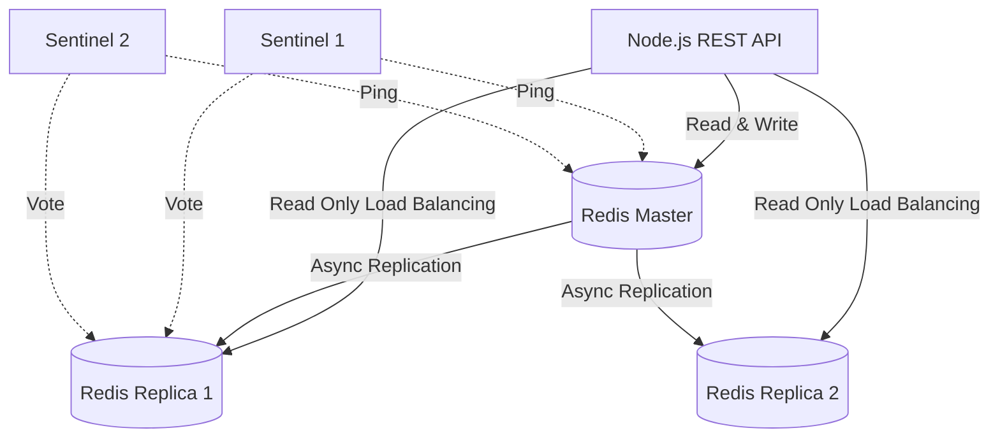

# Scaling Master: Extreme Throughput (Millions of Rows)

NexGen is architected for "Extreme Scaling," capable of processing millions of policy illustrations simultaneously with near-zero latency for the end user.

## 1. The Bottleneck Problem
Calculating benefits for 1 million policies sequentially would block the API for minutes.
- **Solution**: **Horizontal Asynchronicity**.

## 2. Redis Pub/Sub Architecture
1. **API Role**: Purely for ingest. It receives the request, publishes to **Redis**, and returns a status code.
2. **Worker Pool**: Decoupled Node.js instances that "subscribe" to the Redis channel.
3. **Benefit**: We can increase from 1 worker to 100 workers instantly to handle a massive spike in bulk uploads without touching the API code.

### Scaled Architecture (Redis Sentinel)
For high-availability, we implement a quorum-based failover strategy.

## 3. Telemetry & Observability
Extreme scaling requires real-time monitoring. We export metrics to **Prometheus** and visualize them in **Grafana**.

### Key KPI Dashboards:
- **Throughput**: `sum(rate(http_request_duration_seconds_count[1m]))`
- **Latency (P99)**: `histogram_quantile(0.99, sum(rate(http_request_duration_seconds_bucket[5m])) by (le))`
- **Worker Load**: `sum(rate(bulk_records_processed_total[1m]))`

## 4. Database Batching
Instead of `INSERT`ing one row at a time (which requires 1 million network trips), we use **Batch Copying**.
- **Implementation**: We group results and perform bulk `INSERT` statements.
- **Efficiency**: Reduces DB overhead by ~90% for massive data sets.

## 4. Multi-Node Global Scaling
For global scale, we documented the **Redis Sentinel** approach.
- **Replication**: High-availability "Master-Slave" setup for Redis.
- **Health Checks**: Sentinel nodes automatically promote a slave to master if the master fails, ensuring the calculation queue never stops.

## 5. Interview Talking Points:
- **"How do you monitor for bottlenecks?"**: We use Prometheus metrics on the worker queue depth. If the queue grows too long, we auto-scale the worker pods.
- **"Why Redis instead of a simple array?"**: Persistence and distributed access. Multiple servers can access the same Redis channel, whereas a local array is trapped on one machine.
- **"Explain the master-worker pattern in your Node app"**: The master manages CPU core utilization, while workers handle the computation. This ensures we don't have "Cold CPU" syndrome.
