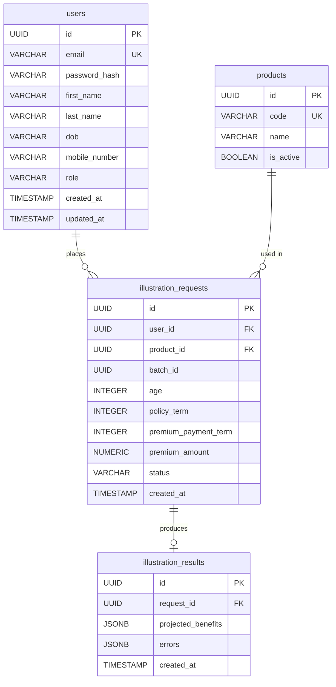

# 🗄️ SQL Reference & Database Schema — NexGen Benefit Illustration Suite

> **Purpose:** Every SQL query used in this project, what it does, why it's written that way, and a full visual database schema.

---

## Table of Contents

1. [Database Schema Diagram (ERD)](#1-database-schema-diagram-erd)
2. [Table Definitions](#2-table-definitions)
3. [All SQL Queries — By Feature](#3-all-sql-queries--by-feature)
   - [Auth — Register](#31-auth--register-a-new-user)
   - [Auth — Login](#32-auth--login)
   - [Auth — Get Profile](#33-auth--get-current-user-profile)
   - [Calculations — Product Validation](#34-calculations--validate-product)
   - [Calculations — Save Request](#35-calculations--save-illustration-request)
   - [Calculations — Save Results](#36-calculations--save-illustration-results)
   - [Bulk — Insert Requests](#37-bulk--batch-insert-requests)
   - [Bulk — Fetch Results](#38-bulk--fetch-batch-results-with-join)
   - [Worker — Process Pending Jobs](#39-worker--fetch-pending-jobs)
   - [Worker — Save Result per Row](#310-worker--insert-result-per-row)
   - [Worker — Mark Completed](#311-worker--mark-request-as-completed)
4. [Schema DDL — Full CREATE Statements](#4-schema-ddl--full-create-statements)
5. [Index Strategy](#5-index-strategy)

---

## 1. Database Schema Diagram (ERD)



### Relationship Summary

| Relationship | Type | Description |
|---|---|---|
| `users` → `illustration_requests` | One-to-Many | A user can run many calculations |
| `products` → `illustration_requests` | One-to-Many | A product can be used in many requests |
| `illustration_requests` → `illustration_results` | One-to-One | Each request produces exactly one result |

---

## 2. Table Definitions

### `users`
Stores registered user accounts with **PII fields masked before storage**.

| Column | Type | Notes |
|---|---|---|
| `id` | UUID | Primary key — generated by app (UUIDv7) |
| `email` | VARCHAR(255) | Unique, used for login |
| `password_hash` | VARCHAR(255) | bcrypt hash (10 rounds) |
| `first_name` | VARCHAR(255) | **Masked** before insert |
| `last_name` | VARCHAR(255) | **Masked** before insert |
| `dob` | VARCHAR(255) | **Date masked** before insert |
| `mobile_number` | VARCHAR(255) | **Phone masked** before insert |
| `role` | VARCHAR(50) | Default: `'CUSTOMER'` |
| `created_at` | TIMESTAMP | Auto |
| `updated_at` | TIMESTAMP | Auto |

---

### `products`
Reference table for insurance products. Seeded on DB initialization.

| Column | Type | Notes |
|---|---|---|
| `id` | UUID | Primary key |
| `code` | VARCHAR(50) | Unique product code e.g. `TL_DEFAULT` |
| `name` | VARCHAR(255) | Display name |
| `is_active` | BOOLEAN | `TRUE` = available, `FALSE` = discontinued |

**Seeded products:**

| ID | Code | Name |
|---|---|---|
| `00000000-...` | `TL_DEFAULT` | Standard Term Life |
| `11111111-...` | `EP_CLASSIC` | Endowment Plan Classic |
| `22222222-...` | `MB_20` | Money Back Plan (20yr) |
| `33333333-...` | `ULIP_GROWTH` | ULIP Growth Fund |

---

### `illustration_requests`
Every calculation job — both single and bulk — is tracked here.

| Column | Type | Notes |
|---|---|---|
| `id` | UUID | Primary key |
| `user_id` | UUID | FK → `users.id` |
| `product_id` | UUID | FK → `products.id` |
| `batch_id` | UUID | `NULL` for single, set for bulk jobs |
| `age` | INTEGER | Policyholder age |
| `policy_term` | INTEGER | Policy duration in years |
| `premium_payment_term` | INTEGER | Years of active premium payment |
| `premium_amount` | NUMERIC(15,2) | Annual premium in ₹ |
| `status` | VARCHAR(50) | `PENDING` / `COMPLETED` |
| `created_at` | TIMESTAMP | Auto |

---

### `illustration_results`
Stores the computed projection as a **JSONB blob**, linked 1:1 to a request.

| Column | Type | Notes |
|---|---|---|
| `id` | UUID | Primary key |
| `request_id` | UUID | FK → `illustration_requests.id` (UNIQUE, CASCADE DELETE) |
| `projected_benefits` | JSONB | Year-by-year projection array |
| `errors` | JSONB | Error details if calculation failed |
| `created_at` | TIMESTAMP | Auto |

**Sample `projected_benefits` JSON:**
```json
[
  { "year": 1, "age": 31, "premium_paid": 50000, "projected_fund_value": 54000.00, "death_benefit": 500000.00 },
  { "year": 2, "age": 32, "premium_paid": 50000, "projected_fund_value": 112320.00, "death_benefit": 500000.00 }
]
```

---

## 3. All SQL Queries — By Feature

---

### 3.1 Auth — Register a New User

#### Query 1: Check if email is already taken
```sql
SELECT id FROM users WHERE email = $1
```
**File:** `routes/rest_auth.js` → `POST /api/auth/register`  
**Why:** Using `SELECT id` instead of `SELECT *` is efficient — only fetches the primary key to check existence. `rowCount > 0` means the email is already registered → return 400.

---

#### Query 2: Insert new user (with masked PII)
```sql
INSERT INTO users (id, email, password_hash, first_name, last_name, dob, mobile_number, role)
VALUES ($1, $2, $3, $4, $5, $6, $7, 'CUSTOMER')
RETURNING id, email, role
```
**File:** `routes/rest_auth.js` → `POST /api/auth/register`  
**Why:**
- `$1`–`$7` are parameterized → prevents SQL injection
- `first_name`, `last_name`, `dob`, `mobile_number` are **pre-masked** by `encryption.js` before being passed as params
- `RETURNING id, email, role` avoids a second SELECT query — we get the new user's details in one round-trip
- Role is hardcoded as `'CUSTOMER'` in the SQL itself (not from user input) → prevents privilege escalation

---

### 3.2 Auth — Login

#### Query 3: Fetch user by email for credential check
```sql
SELECT id, email, password_hash, role FROM users WHERE email = $1
```
**File:** `routes/rest_auth.js` → `POST /api/auth/login`  
**Why:**
- Fetches only the columns needed for auth (`password_hash` for bcrypt.compare, `role` for JWT payload)
- Does NOT fetch PII fields (first_name, dob, etc.) — not needed here = less data transferred
- If `rowCount === 0` → return 401 (same error message as wrong password to prevent email enumeration)

---

### 3.3 Auth — Get Current User Profile

#### Query 4: Fetch full profile by user ID
```sql
SELECT id, email, role, first_name, last_name, dob, mobile_number
FROM users
WHERE id = $1
```
**File:** `routes/rest_auth.js` → `GET /api/auth/me`  
**Why:**
- `req.user.id` comes from the verified JWT — no user input involved
- Intentionally **excludes** `password_hash` from the SELECT list — never expose it in an API response
- Note: `first_name`, `dob`, `mobile_number` are returned **masked** (they were masked on insert)

---

### 3.4 Calculations — Validate Product

#### Query 5: Check product exists and is active
```sql
SELECT id FROM products WHERE id = $1 AND is_active = TRUE
```
**File:** `routes/rest_calculations.js` → `POST /api/calculations/calculate`  
**Why:**
- Two conditions in one query: product must exist AND must be active
- If a product is discontinued (`is_active = FALSE`), it's rejected without changing the schema
- `SELECT id` only — we only need to confirm existence, not fetch all columns

---

### 3.5 Calculations — Save Illustration Request

#### Query 6: Insert a single illustration request (status = COMPLETED)
```sql
INSERT INTO illustration_requests
  (id, user_id, product_id, age, policy_term, premium_payment_term, premium_amount, status)
VALUES ($1, $2, $3, $4, $5, $6, $7, 'COMPLETED')
```
**File:** `routes/rest_calculations.js` → `POST /api/calculations/calculate`  
**Why:**
- For **single** calculations, status is immediately set to `'COMPLETED'` because the result is computed synchronously in the same request
- For **bulk** calculations, status starts as `'PENDING'` (see Query 8)
- No `RETURNING` clause needed here — we already have the `request_id` we generated in Node.js

---

### 3.6 Calculations — Save Illustration Results

#### Query 7: Insert computed JSONB result
```sql
INSERT INTO illustration_results (id, request_id, projected_benefits)
VALUES ($1, $2, $3)
```
**File:** `routes/rest_calculations.js` → `POST /api/calculations/calculate`  
**Why:**
- `projected_benefits` is stored as `JSONB` — PostgreSQL can index and query inside JSON if needed
- `JSONB` (binary JSON) is faster to query than `JSON` text type in PostgreSQL
- The entire year-by-year projection array is stored in one row → no need for a `results_per_year` table
- `request_id` is `UNIQUE` in the schema → prevents duplicate results for same request

---

### 3.7 Bulk — Batch Insert Requests

#### Query 8: Insert one bulk row (run concurrently via Promise.allSettled)
```sql
INSERT INTO illustration_requests
  (id, user_id, product_id, batch_id, age, policy_term, premium_payment_term, premium_amount, status)
VALUES ($1, $2, $3, $4, $5, $6, $7, $8, 'PENDING')
```
**File:** `routes/rest_bulk.js` → `POST /api/bulk/upload`  
**Why:**
- Status is `'PENDING'` — the actual calculation happens **asynchronously** in the background worker
- All rows share the same `batch_id` — this is the tracking key for the whole bulk job
- `Promise.allSettled` runs all inserts concurrently — if 1 row fails (e.g. invalid UUID), others still succeed
- Each row gets a fresh `generateId()` — UUIDv7 with embedded timestamp for time-ordering

---

### 3.8 Bulk — Fetch Batch Results (with JOIN)

#### Query 9: Fetch all results for a batch with JOIN
```sql
SELECT
  r.id           AS request_id,
  r.product_id,
  r.age,
  r.policy_term,
  r.premium_amount,
  r.status,
  res.projected_benefits
FROM illustration_requests r
LEFT JOIN illustration_results res ON r.id = res.request_id
WHERE r.batch_id = $1
  AND r.user_id  = $2
```
**File:** `routes/rest_bulk.js` → `GET /api/bulk/:batch_id/results`  
**Why:**
- `LEFT JOIN` — includes requests even if their result isn't ready yet (`res.projected_benefits` = NULL means still PENDING)
- `AND r.user_id = $2` — security check: users can only see their own batches, not others'
- Frontend uses this to show a progress bar: count rows where `status = 'COMPLETED'` vs total
- Index `idx_requests_batch` on `batch_id` makes this query fast even for 10,000 row batches

---

### 3.9 Worker — Fetch Pending Jobs

#### Query 10: Fetch all PENDING rows for a batch
```sql
SELECT *
FROM illustration_requests
WHERE batch_id = $1
  AND status = 'PENDING'
```
**File:** `workers/calculationWorker.js`  
**Why:**
- Worker receives `batch_id` from Redis Pub/Sub and immediately queries for all rows that still need processing
- `AND status = 'PENDING'` — idempotent guard: if a message is re-delivered (e.g. after a crash), already-completed rows are skipped
- Uses compound index `idx_requests_batch` + `idx_requests_status` so PostgreSQL scans only the matching batch

---

### 3.10 Worker — Insert Result per Row

#### Query 11: Insert calculation result for one row
```sql
INSERT INTO illustration_results (id, request_id, projected_benefits)
VALUES ($1, $2, $3)
```
**File:** `workers/calculationWorker.js`  
**Why:**
- Same as Query 7 but called for each row in a bulk batch
- Because `request_id` has a `UNIQUE` constraint, re-running this for the same request will throw a conflict error — caught by `Promise.allSettled`, logged, but doesn't crash the worker

---

### 3.11 Worker — Mark Request as Completed

#### Query 12: Update status to COMPLETED after result saved
```sql
UPDATE illustration_requests
SET status = 'COMPLETED'
WHERE id = $1
```
**File:** `workers/calculationWorker.js`  
**Why:**
- This runs **after** the result is successfully inserted — not before
- If the INSERT (Query 11) fails, this UPDATE is never called → row stays `PENDING` and can be retried
- Frontend polls `GET /api/bulk/:id/results` and counts COMPLETED rows vs. total for progress tracking

---

## 4. Schema DDL — Full CREATE Statements

```sql
-- Users table with PII storage
CREATE TABLE users (
    id              UUID         PRIMARY KEY,
    email           VARCHAR(255) UNIQUE NOT NULL,
    password_hash   VARCHAR(255) NOT NULL,
    first_name      VARCHAR(255),
    last_name       VARCHAR(255),
    dob             VARCHAR(255),          -- stored masked
    mobile_number   VARCHAR(255),          -- stored masked
    role            VARCHAR(50)  DEFAULT 'CUSTOMER',
    created_at      TIMESTAMP    DEFAULT CURRENT_TIMESTAMP,
    updated_at      TIMESTAMP    DEFAULT CURRENT_TIMESTAMP
);
CREATE INDEX idx_users_email ON users(email);

-- Insurance product catalogue
CREATE TABLE products (
    id        UUID        PRIMARY KEY,
    code      VARCHAR(50) UNIQUE NOT NULL,
    name      VARCHAR(255) NOT NULL,
    is_active BOOLEAN     DEFAULT TRUE
);

-- Every illustration job (single + bulk)
CREATE TABLE illustration_requests (
    id                    UUID           PRIMARY KEY,
    user_id               UUID           REFERENCES users(id),
    product_id            UUID           REFERENCES products(id),
    batch_id              UUID,          -- NULL for single; set for bulk
    age                   INTEGER,
    policy_term           INTEGER,
    premium_payment_term  INTEGER,
    premium_amount        NUMERIC(15,2),
    status                VARCHAR(50)    DEFAULT 'PENDING',
    created_at            TIMESTAMP      DEFAULT CURRENT_TIMESTAMP
);
CREATE INDEX idx_requests_status ON illustration_requests(status);
CREATE INDEX idx_requests_batch  ON illustration_requests(batch_id);
CREATE INDEX idx_requests_user   ON illustration_requests(user_id);

-- Computed projection stored as JSONB
CREATE TABLE illustration_results (
    id                  UUID  PRIMARY KEY,
    request_id          UUID  UNIQUE REFERENCES illustration_requests(id) ON DELETE CASCADE,
    projected_benefits  JSONB NOT NULL,
    errors              JSONB,
    created_at          TIMESTAMP DEFAULT CURRENT_TIMESTAMP
);
```

---

## 5. Index Strategy

| Index Name | Table | Column | Why |
|---|---|---|---|
| `idx_users_email` | `users` | `email` | Login lookup by email — runs on every login |
| `idx_requests_status` | `illustration_requests` | `status` | Worker queries PENDING rows frequently |
| `idx_requests_batch` | `illustration_requests` | `batch_id` | Bulk result fetch and worker processing |
| `idx_requests_user` | `illustration_requests` | `user_id` | User's own history queries |

**Why not index `products.id`?** It's a `PRIMARY KEY` — PostgreSQL creates a B-tree index on it automatically.

**Why not index `illustration_results.request_id`?** It's `UNIQUE` — PostgreSQL creates an index automatically for unique constraints.

---

## Query Quick Reference

| Query # | SQL | Endpoint | Table |
|---|---|---|---|
| Q1 | `SELECT id FROM users WHERE email = $1` | POST /register | users |
| Q2 | `INSERT INTO users ... RETURNING id, email, role` | POST /register | users |
| Q3 | `SELECT id, email, password_hash, role FROM users WHERE email = $1` | POST /login | users |
| Q4 | `SELECT id, email, role, ... FROM users WHERE id = $1` | GET /me | users |
| Q5 | `SELECT id FROM products WHERE id = $1 AND is_active = TRUE` | POST /calculate | products |
| Q6 | `INSERT INTO illustration_requests ... status='COMPLETED'` | POST /calculate | illustration_requests |
| Q7 | `INSERT INTO illustration_results ...` | POST /calculate | illustration_results |
| Q8 | `INSERT INTO illustration_requests ... status='PENDING'` | POST /bulk/upload | illustration_requests |
| Q9 | `SELECT ... FROM illustration_requests LEFT JOIN illustration_results ...` | GET /bulk/:id/results | both |
| Q10 | `SELECT * FROM illustration_requests WHERE batch_id=$1 AND status='PENDING'` | Worker | illustration_requests |
| Q11 | `INSERT INTO illustration_results ...` | Worker | illustration_results |
| Q12 | `UPDATE illustration_requests SET status='COMPLETED' WHERE id=$1` | Worker | illustration_requests |

---

*© 2026 NexGen Financial Technologies — Internal Learning Document*
